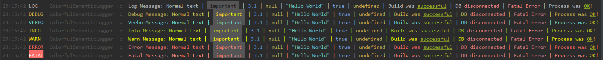
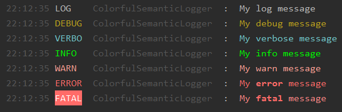
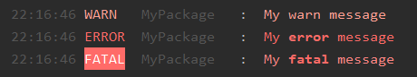
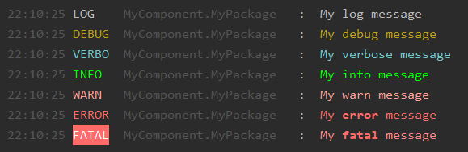
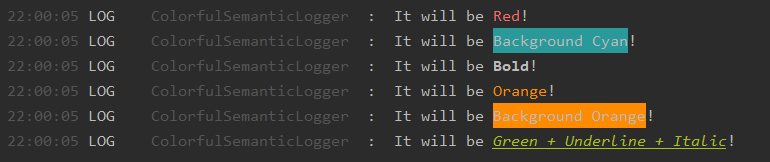
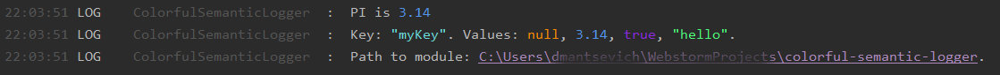
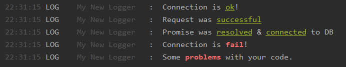

# Colorful 🌈 Semantic 📖 Logger 🔢 for Node.js

## Overview
Fast and simple log service, which can highlight important words, types & tags. 👨🏻‍💻

[](https://www.npmjs.com/package/@dmantsevich/colorful-semantic-logger)

## Features
- [x] Colorful 🌈
- [x] Highlight reserved words 
- [x] Highlight types 
- [x] Highlight tags 
- [x] Color by tags 
- [x] Custom formatting 
- [x] Configurable 
- [x] Different log levels 
- [x] Shortcodes
- [x] etc.

## How to use
### Install
1) Install **[NodeJs](https://nodejs.org/en/)** (This will also install **npm**)
2) Install [@dmantsevich/colorful-semantic-logger](https://www.npmjs.com/package/@dmantsevich/colorful-semantic-logger) as dependency for your project (👍):
```shell script
npm i @dmantsevich/colorful-semantic-logger --save
```

### Usages

#### Simple
```js
const { logger } = require('@dmantsevich/colorful-semantic-logger');

logger.log(`My log message`);
logger.debug(`My debug message`);
logger.verbose(`My verbose message`);
logger.info(`My info message`);
logger.warn(`My warn message`);
logger.error(`My error message`);
logger.fatal(`My fatal message`);
```


### With name
```js
const { Logger } = require('@dmantsevich/colorful-semantic-logger');

const logger = new Logger('Logger For My Package');

logger.log(`My log message`);
logger.debug(`My debug message`);
logger.verbose(`My verbose message`);
logger.info(`My info message`);
logger.warn(`My warn message`);
logger.error(`My error message`);
logger.fatal(`My fatal message`);
```


### With options
```js
const { Logger, LEVELS } = require('@dmantsevich/colorful-semantic-logger');

const logger = new Logger('MyPackage', { level: LEVELS.WARN }); // filter by only WARN+ criteria

logger.log(`My log message`);
logger.debug(`My debug message`);
logger.verbose(`My verbose message`);
logger.info(`My info message`);
logger.warn(`My warn message`);
logger.error(`My error message`);
logger.fatal(`My fatal message`);
```



### Sub logger
```js
const { Logger, LEVELS } = require('@dmantsevich/colorful-semantic-logger');

const packageLogger = new Logger('MyPackage', { level: LEVELS.DEBUG });
const logger = packageLogger.createNew('MyComponent', { level: LEVELS.FATAL }); // name will be: MyComponent.MyPackage

logger.log(`My log message`);
logger.debug(`My debug message`);
logger.verbose(`My verbose message`);
logger.info(`My info message`);
logger.warn(`My warn message`);
logger.error(`My error message`);
logger.fatal(`My fatal message`);
```


### Tags
Tag is a text between ``<tagName>..that text will be processed..</tagName>``. It helps to format & paint your message. Tags & their formats are configurable. **[See configuration](#configuration)**. 

### Reserved words
Colorful Semantic Logger can highlights important words in your logs. **[See configuration](#configuration)**.

## API
### Package
Default module exports next objects:
- **ColorfulSemanticLogger(name, options)**: Main logger class. {_name_} - name/group for your custom logger. {_options_} - see **[configuration](#configuration)**.
- **Logger**: the same as ColorfulSemanticLogger. Just shortname.
- **logger**: default instance of ColorfulSemanticLogger class with default options.
- **LEVELS**: Log levels. Levels: DEBUG, LOG, INFO, WARN, FATAL, ERROR, VERBOSE
- unpacked **LEVELS** object

## Logger instance
For creating new logger, you need to create new instance:
```js
const { Logger } = require('@dmantsevich/colorful-semantic-logger');
const logger = new Logger('My New Logger', {});
logger.log('I want to say: <underline>Hello World!</underline>');
```


### Methods
- **logger.debug(msg, ...)**: Print ``debug`` message 
- **logger.verbose(msg, ...)**: Print ``verbose`` message  
- **logger.info(msg, ...)**: Print ``info`` message 
- **logger.log(msg, ...)**: Print ``log`` message. The same as ``info``, but white.
- **logger.warn(msg, ...)**: Print ``warn`` message.
- **logger.error(msg, ...)**: Print ``error`` message.
- **logger.throwError(msg, ...)**: Print ``error`` message and then throw new Error.
- **logger.fatal(msg, ...)**: Print ``fatal`` message.
- **logger.throwFatal(msg, ...)**: Print ``fatal`` message and then throw new Error.
- **logger.print(infoMsg, verboseMsg)**: Easy way to print different messages for ``INFO`` & ``VERBOSE`` levels.
- **logger.createNew(name[, options])**: create new sublogger. Sublogger uses namespace(split by dot) and same configuration.
- **logger.removeTags(msg, ...)**: remove tags(only tags, not content) from message.
- **Logger.LEVELS** (static property in the class): Contains levels: LOG, INFO, DEBUG, VERBOSE, FATAL, ERROR, WARN  

## Configuration
Options for ``ColorfulSemanticLogger(name, options) or Logger(name, options)`` class.

| Param     | Type      | Default Value     | Description |
|--------   |:------:   |:---------------:  |-------------|
| ``level``  | *{object}* | **LEVELS.INFO**            | Default log level. Can be overrided with commandline: --log-level=error |
| ``colorful``  | *{bool}* | **true**            | Output should be colored or not|
| ``semanticData``  | *{object}* | See: **lib/options.js**            | Configuration for semantic parser |
| ``semanticData.tags``  | *{object}* | See: **lib/options.js**            | Predefined tags. Key is "tagName". Value is _function_ or string _hex color_. Function retrieve 2 argumentas: **innerTagText**, **logger** instance |
| ``semanticData.reservedWords``  | *{array}* | See: **lib/options.js**            | Array with objects. _words_: array of reserved words. _color_: _function_ or string _hex color_. Function retrieve 2 argumentas: **reservedWord**, **logger** instance |
| ``shortCodes``  | *{object}* | See: **lib/options.js**            | Object with shortcodes. Key is shortcode. Value is _function_. Function retrieve: **logger** instance |
| ``headerFormat``  | *{string/function}* | **<time.now/> \<level/> \<loggerName/>:**  | Header format. Can be string or function. String supports **options.shortCodes**. Function retrive **logger** instance |


## Semantic Data - Tags
Predefined tags: **number**, **key**, **value**, **!** (important!), **path**.

Also possible to use [chalk](https://www.npmjs.com/package/chalk) API as tags. Example:
```js
const { Logger } = require('@dmantsevich/colorful-semantic-logger');
const logger = new Logger('My Test Logger');

logger.log('It will be <red>Red</red>!');
logger.log('It will be <bgCyan>Background Cyan</bgCyan>!');
logger.log('It will be <bold>Bold</bold>!');
logger.log('It will be <#FF8C00>Orange</#FF8C00>!');
logger.log('It will be <bg#FF8C00>Background Orange</bg#FF8C00>!');
logger.log('It will be <green.underline.italic>Green + Underline + Italic</green.underline.italic>!');

``` 



### How to use:
```js
const { Logger } = require('@dmantsevich/colorful-semantic-logger');
const logger = new Logger('My Test Logger');

logger.log(`PI is <number>3.14</number>`); // 3.14 will be highlighted
logger.log(`Key: <key>myKey</key>. Values: <value>null</value>, <value>3.14</value>, <value>true</value>, <value>hello</value>.`); // null, 3.14, true, hello will be  highlighted
logger.log(`Path to module: <path>${__dirname}</path>.`); // __dirname value will be highlighted and parsed as path(relative for cwd).
``` 


### How to define new
```js
{
  makeRed: '#ff00ff', // tag is makeRed. color will be "#ff00ff" <makeRed>Hello World</makeRed>
  status: (v, logger) => 'Status:' + logger._paint(v, '#40e0d0') // tag is "status". Use: <status>200</status> -> Status: 200 (where 200 will be green). 
}
```  

## Semantic Data - Reserved Words
Reserved words helps to highlight important words in your logs.

Predefined reserved words:
- group "ok": **'success', 'successful', 'ok', 'done', 'fine', 'connected', 'resolved', 'cool'** : underlined + green
- group "not ok": **'fail', 'error', 'errors', 'fatal', 'reject', 'rejected', 'issue', 'disconnect', 'disconnected', 'issue', 'bug', 'problem', 'problems', 'exception', 'exceptions', 'throw'** : bold + red

### How to use
```js
logger.log(`Connection is ok!`); // ok will be highlighted 
logger.log(`Request was successful`); // successful will be highlighted 
logger.log(`Promise was resolved & connected to DB`); // resolved & connected will be highlighted

logger.log(`Connection is fail!`); // fail will be highlighted 
logger.log(`Some problems with your code.`); // problems will be highlighted 
``` 


### How to define new
```js
[{
    words: ['start', 'begin'], // start action
    color: (value, logger) => logger._paint(value, 'cyan') 
}, {
    words: ['end', 'complete'], // end action
    color: (value, logger) => logger._paint(value, 'magenta') 
}]
```

## ShortCodes
ShortCodes uses for head formating (example: ``<time.now/> <level/>(<random/>): ``).

Default ShortCodes: **<time.now/>, <date.now/>, \<loggerName/>, \<level/>**

Example:
```js
{
  'random': (logger) => Math.random(),
  'random.color': 'gray' 
}
```

## Links

[](https://www.npmjs.com/package/@dmantsevich/colorful-semantic-logger)

[](https://github.com/dmantsevich/colorful-semantic-logger)


🧰 

---
**2021**